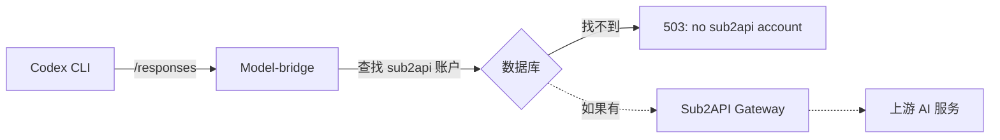

# Codex 503 错误分析报告

## 问题现象

使用 Codex 时反复出现 `503 Service Unavailable` 错误：

```json
{
  "error": "no sub2api account configured"
}
```

**用户误解**：以为需要"重新连接"才能使用，但实际上每次都会失败。

---

## 根本原因

**Codex 请求被路由到了 `sub2api` provider，但系统中没有配置任何 sub2api 账户。**

### 代码逻辑追踪

在 [src/routes/relay.ts:1352-1358](src/routes/relay.ts#L1352-L1358)：

```typescript
const account = await pickAccount(
  provider.id,
  tried,
  sessionKey,
  apiKey.accountGroupId ?? null,
  parsed.model,
)
if (!account) {
  await reply.code(503).send({
    error: tried.length
      ? `all ${provider.id} accounts are unavailable`
      : `no ${provider.id} account configured`,  // ← 这里触发
  })
  return
}
```

当 `pickAccount()` 在数据库中找不到任何 `provider = 'sub2api'` 的账户时，就会返回这个错误。

---

## 为什么会路由到 sub2api？

### 1. Codex 使用的 API 端点

从你的截图和项目配置推断，Codex 客户端正在请求：

```
https://www.modelbridge.site/responses
```

这个路径会被路由到 `sub2api-responses` provider（见 [src/routes/relay.ts:572-584](src/routes/relay.ts#L572-L584)）。

### 2. Provider 路由规则

在 relay.ts 中定义了三个 sub2api 相关的路由：

- `sub2api` → `/v1/messages` (Anthropic Messages API)
- `sub2api-chat` → `/v1/chat/completions` (OpenAI Chat API)
- `sub2api-responses` → `/responses` (OpenAI Responses API，Codex 使用)

### 3. Sub2API 的设计意图

Sub2API 是一个**中继上游**（relay-to-relay），用于：
- 将请求转发到另一个 API 网关（如 Sub2API 服务）
- 该网关内部管理自己的账户池
- Model-bridge 只需存储 Sub2API 的 API Key 和 Base URL

---

## 解决方案

### 方案 1：配置 Sub2API 账户（推荐）

如果你确实想通过 Sub2API 作为上游，需要添加 sub2api 账户：

1. 获取 Sub2API 的 API Key 和 Base URL
2. 通过管理面板或 API 导入账户

**账户配置示例**：

```json
{
  "accounts": [
    {
      "provider": "sub2api",
      "name": "Sub2API Gateway",
      "accessToken": "sk-sub2api-xxxxxxxxxxxxx",
      "proxyUrl": "https://api.sub2api.com",
      "weight": 10,
      "notes": "Sub2API 中继网关"
    }
  ]
}
```

**关键字段**：
- `provider`: 必须是 `"sub2api"`
- `accessToken`: Sub2API 提供的 API Key
- `proxyUrl`: Sub2API 的 Base URL（用于路由请求）

### 方案 2：更改 Codex 配置使用直连账户

如果你不想使用 Sub2API，而是直接使用 OpenAI/Claude 等账户：

#### 检查当前配置

查看 Codex 的配置文件（通常在 `~/.codex/config.json` 或类似位置），找到类似这样的配置：

```json
{
  "baseUrl": "https://www.modelbridge.site"
}
```

#### 更改端点路径

根据你已有的账户类型，更改 Codex 的 API 端点：

| 已有账户类型 | 应使用的端点 | 对应 Model-bridge 路由 |
|------------|-----------|---------------------|
| OpenAI | `/v1/chat/completions` | `openai-chat` |
| Claude | `/v1/messages` | `claude` |
| DeepSeek | `/v1/messages` 或 `/responses` | `deepseek` / `deepseek-responses` |
| Gemini | `/v1/messages` | `gemini` |

**注意**：Codex CLI 默认使用 `/responses` 端点，这可能需要在 Codex 配置中明确指定。

### 方案 3：添加 OpenAI 账户并配置正确的路由

如果你想让 Codex 通过 Model-bridge 直接访问 OpenAI：

1. 确保数据库中有 `provider = 'openai'` 的账户
2. 配置 Codex 使用 `/v1/chat/completions` 端点
3. 或者启用 `openai-responses` 路由（如果存在）

---

## 为什么不是"连接"问题

### 误解来源

用户可能认为需要"重新连接"是因为：
- 错误提示 `503 Service Unavailable` 看起来像服务器宕机
- 重试时可能偶尔看到不同的错误信息
- 不了解账户池的概念

### 实际情况

这是一个**配置问题**，不是连接问题：

1. HTTP 连接是正常的（返回了 503 响应）
2. Model-bridge 服务正在运行
3. 问题在于**账户池为空**



每次请求都会经历相同的路径，结果总是一样：**账户池为空 → 503 错误**。

---

## 如何验证和修复

### 步骤 1：检查数据库中的账户

运行以下 SQL 查询（或通过管理面板查看）：

```sql
SELECT provider, name, status, weight 
FROM accounts 
WHERE provider = 'sub2api';
```

**预期结果**：
- 如果返回空结果 → 需要添加 sub2api 账户（方案 1）
- 如果有账户但 `status != 'active'` → 需要启用账户

### 步骤 2：检查 API Key 配置

确认你的 API Key 允许访问 sub2api provider：

```sql
SELECT id, allowed_providers 
FROM api_keys 
WHERE id = '<你的 API Key ID>';
```

如果 `allowed_providers` 不为 NULL，确保包含 `'sub2api'`。

### 步骤 3：测试配置

添加账户后，使用 curl 测试：

```bash
curl -X POST https://www.modelbridge.site/responses \
  -H "Authorization: Bearer <你的 Model-bridge API Key>" \
  -H "Content-Type: application/json" \
  -d '{
    "model": "claude-3-5-sonnet-20241022",
    "stream": true,
    "messages": [{"role": "user", "content": "test"}]
  }'
```

**成功响应**：流式 SSE 数据
**失败响应**：503 错误 → 重新检查账户配置

---

## 相关代码位置

- 错误生成：[src/routes/relay.ts:1352-1358](src/routes/relay.ts#L1352-L1358)
- Sub2API 路由定义：[src/routes/relay.ts:548-584](src/routes/relay.ts#L548-L584)
- 账户选择逻辑：[src/accounts/scheduler.ts:42](src/accounts/scheduler.ts#L42)
- Provider 注册：[src/providers/registry.ts:135-146](src/providers/registry.ts#L135-L146)
- 账户导入示例：[docs/account-import-example.json](docs/account-import-example.json)

---

## 总结

**问题**：Codex 请求 `/responses` 端点 → 路由到 `sub2api-responses` → 数据库中没有 sub2api 账户 → 503 错误

**不是连接问题**：每次请求都能到达 Model-bridge，只是账户池配置不正确

**修复方向**：
1. 添加 sub2api 账户配置（如果你有 Sub2API 服务）
2. 或者更改 Codex 配置使用其他 provider 的端点

---

## 附录：Sub2API 账户配置完整流程

### 通过 Web 管理面板

1. 登录 Model-bridge 管理面板
2. 进入"账户管理"
3. 点击"添加账户"
4. 选择 Provider: `sub2api`
5. 填写：
   - Name: 自定义名称
   - Access Token: Sub2API 的 API Key
   - Proxy URL: Sub2API 的 Base URL
   - Weight: 权重（默认 10）
6. 保存

### 通过 API 导入

```bash
curl -X POST http://localhost:3000/admin/accounts/import \
  -H "Authorization: Bearer <管理员 Token>" \
  -H "Content-Type: application/json" \
  -d '{
    "accounts": [{
      "provider": "sub2api",
      "name": "Sub2API Gateway",
      "accessToken": "sk-sub2api-xxxxx",
      "proxyUrl": "https://api.sub2api.com",
      "weight": 10
    }]
  }'
```

### 通过 JSON 文件导入

创建 `sub2api-accounts.json`：

```json
{
  "accounts": [
    {
      "provider": "sub2api",
      "name": "Sub2API Main",
      "accessToken": "sk-sub2api-xxxxxxxxxxxxx",
      "proxyUrl": "https://api.sub2api.com",
      "weight": 10,
      "concurrencyLimit": 5,
      "notes": "主要 Sub2API 网关"
    }
  ]
}
```

然后在管理面板上传或通过 API 导入。
